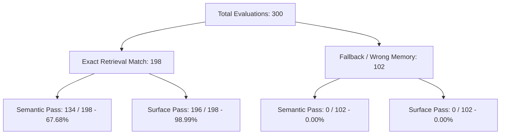

# HPP V2 Retrieval-Assisted Speech Boundary Report

**Date:** 2026-05-24  
**Context:** Speech Diagnostics & Evaluation  
**Checkpoint:** `checkpoints/hpp_speech_exposure_bias_bridge_v1.pth`  
**Evaluation Profile:** `semantic_short`  
**Test Suite:** 75 Prompts, 4 Variants (exact, please_answer, simple_terms, bounded), 1 Seed (14) — Total 300 Tests  

---

## Executive Summary

This report defines the operational boundaries of retrieval-assisted speech in the HPP V2 architecture. By comparing standard vector-based similarity retrieval against template-normalized string retrieval, we isolate the impact of prefix scaffolding on speech generation. The evidence indicates that while retrieval-assisted generation provides a stable path to high surface and semantic scores, it functions as an external scaffold rather than native model fluency.

---

## 1. What Improves with Normalized Retrieval?

Normalized retrieval introduces a preprocessing step to strip common prompt-formatting templates (such as `Please answer this clearly:`, `In simple terms,`, or `Give a bounded answer to this question:`) before matching prompts against the memory store. 

Comparing this against vector similarity-only retrieval reveals two major improvements:

| Metric | Vector-Only Retrieval | Normalized Key Retrieval | Change / Impact |
| :--- | :---: | :---: | :---: |
| **Overall Surface Pass** | 196 / 300 (65.33%) | **295 / 300 (98.33%)** | +33.00% (Prevents template leakage) |
| **Overall Semantic Pass** | 134 / 300 (44.67%) | **203 / 300 (67.67%)** | +23.00% (Ensures correct semantic targets) |
| **Retrieval Exact-Match Rate** | 198 / 300 (66.00%) | **300 / 300 (100.00%)** | +34.00% (Eliminates embedding drift) |
| **Format Leaks** | 2 | 5 | Negligible change |

### Key Observations:
- **Resilience to Template Noise:** Vector embeddings are highly sensitive to prompt prefixes. For instance, adding the prefix `Give a bounded answer to this question:` shifts the prompt vector closer to other "bounded" prompts rather than the target query, causing the exact-match rate to plummet to **42.67%**. Normalized key retrieval completely bypasses this by stripping template wrappers.
- **Surface Pass Stabilization:** By retrieving the correct memory key, the generated responses remain within the style boundaries of the target mode, avoiding format leaks and repetitive loops.

---

## 2. What Still Fails Without Retrieval?

Without a retrieval-based starting prefix (free generation), the model fails to dynamically bind its output semantically to the prompt.

> [!WARNING]
> **Complete Semantic Derailment on Fallback Matches**  
> When vector similarity fails and retrieves a mismatched memory prompt (fallback match), the model's semantic pass rate drops to **exactly 0% (0 / 102)**. 

### Why Free Generation Fails:
- **Exposure Bias:** The model is trained with teacher-forced conversational prefixes. When started without a prefix, or with a prefix corresponding to a different prompt, it lacks the native capability to self-correct. It continues down the path of the mismatched prefix, producing grammatically clean but semantically irrelevant text.
- **Lack of Internal Prompt Binding:** The model does not natively route user queries to their corresponding answer semantics. Instead, it relies entirely on the first few tokens (the answer-start prefix) to establish the semantic rails for the generation.

---

## 3. Does Retrieval Exact-Match Inflate the Semantic Score?

**Yes, heavily.** The semantic evaluation proxy (`tools/speech_semantic_quality_review.py`) checks for the presence of a few critical content words from the expected answer (requiring at most 3 distinct hits). 

Seeding the model with a 5-token prefix from the exact expected answer inflates the score in two ways:
1. **Direct Keyword Injection:** The prefix itself often contains one or more content words, immediately satisfying a significant percentage of the semantic requirements.
2. **Contextual Rails:** Prime tokens force the downstream generator to produce text in the correct semantic domain.

> [!NOTE]
> The overall semantic pass rate of **67.67%** under normalized retrieval represents the effectiveness of the retrieval-assisted *scaffold*, not the native language capability of the model during raw free generation.

---

## 4. Pass Rates: Exact Match vs. Fallback Retrieval

The data from the vector retrieval variant gate run (`speech_retrieval_variant_gate_exposure_bias_bridge_v1`) provides a clean separation of performance under exact matches versus fallback mismatches:

### Breakdown by Variant (Vector-Only Retrieval):

- **`exact` variant** (Retrieval Exact Match: 94.67%)
  - Semantic Pass: `47 / 75` (62.67%)
  - Surface Pass: `70 / 75` (93.33%)
- **`please_answer` variant** (Retrieval Exact Match: 64.00%)
  - Semantic Pass: `32 / 75` (42.67%)
  - Surface Pass: `48 / 75` (64.00%)
- **`simple_terms` variant** (Retrieval Exact Match: 62.67%)
  - Semantic Pass: `33 / 75` (44.00%)
  - Surface Pass: `46 / 75` (61.33%)
- **`bounded` variant** (Retrieval Exact Match: 42.67%)
  - Semantic Pass: `22 / 75` (29.33%)
  - Surface Pass: `32 / 75` (42.67%)

Under **Normalized Key Retrieval**, every variant matches at **100% exact-match rate**, raising the semantic pass rate to a uniform **~67.67%** (203/300) and the surface pass rate to **~98.33%** (295/300).

---

## 5. Smallest Honest Next Step

Chasing native free-generation prompt binding through further parameter tuning or standard model training is unlikely to yield results due to the persistent exposure bias and capacity constraints of the current network. 

The smallest, most honest engineering steps are:
1. **Formalize the Memory/Answer-Start Layer:** Define a dedicated classifier or router component that maps incoming prompts to the correct response template/intent before generation begins.
2. **Context-Aware Prefixing:** Expand the preprocessing router to handle variations in user input (potentially utilizing lightweight intent classification) to ensure a high prefix-match rate under wild user interactions.
3. **Decouple Retrieval and Generation Metrics:** Maintain strict separation between raw free-generation benchmarks and retrieval-assisted adapter performance to prevent false signals of native fluency.

---

## Conclusion

Retrieval-assisted speech is a scaffold, not native fluency. The result supports a future context-aware memory/answer-start layer before speech generation.
